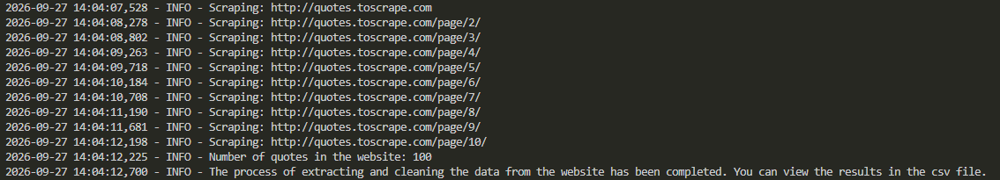

# Quotes Scraper — Web Scraping & Data Cleaning with Python
Extracts data for 100 quotes (Author name, His quote, Author page link, Tags) from all http://quotes.toscrape.com pages, processes it fully with pandas (cleaning and organizing), and exports it cleanly to a CSV file.



___

## ✨ Features :
- Automatically paginates through **all pages** on quotes.toscrape.com (not just the homepage) collecting every quote until the last page
- Extracts quote text, author name, author profile link, and all tags for each entry, handling multiple tags per quote without duplication
- Dual-level logging (console + file) that records every step of the scraping process, making debugging effortless
- Graceful handling of missing data; the script keeps running even if a field is unavailable, instead of failing
- Clean, structured CSV output (UTF-8 with BOM) ready to open directly in Excel or feed into other tools
- Tags stored as a readable comma-separated string instead of raw list objects, keeping the CSV analysis-friendly
___

## ✨ Prerequisites :
- **Python 3.8+**
- **Git**
___

## ✨ Installation :
1. Clone the project :
```bash
git clone https://github.com/Zino0003/quotes-scraper.git
cd quotes-scraper
```
2. Creating the virtual environment (quotes_scraper_venv) and activate it :
```bash
python -m venv quotes_scraper_venv
```
- Activate on Windows (Git Bash) :
```bash
source quotes_scraper_venv/Scripts/activate
```
- Activate on Windows (CMD / PowerShell) :
```bash
quotes_scraper_venv\Scripts\activate
```
- Activate on macOS / Linux :
```bash
source quotes_scraper_venv/bin/activate
```
3. Install the libraries :
```bash
pip install -r requirements.txt
```
___

## ✨ Usage : 
- Run the code :
```bash
python quotes_scraper.py
```
The script will:
1. Scrape quote data (Author name, quote, Author page link, Tags) from quotes.toscrape.com
2. Clean and process the data using pandas
3. Export the final results to `Quotes_scraping.csv`

A log file (`quotes_scraper.log`) will also be created, recording the scraping process and any errors encountered.
### Sample Output (Quotes_scraping.csv)

| Author name | His quote | Author page link | Tags |
|---|---|---|---|
| Steve Martin | "A day without sunshine is like, you know, night." | /author/Steve-Martin | humor, obvious, simile |
| Bob Marley | "One good thing about music, when it hits you, you feel no pain." | /author/Bob-Marley | music |
| Stephenie Meyer | "He's like a drug for you, Bella." | /author/Stephenie-Meyer | drug, romance, simile |
___

## ✨ Project Structure :
```text
quotes-scraper/
├── quotes_scraper.py      # Main script (scraping)
├── requirements.txt       # Python dependencies
├── Quotes_scraping.csv    # Sample output (cleaned)
├── Attached_files/        # Output screenshots
├── LICENSE                # License file
├── .gitignore             # Git ignore rules
└── README.md              # Project documentation
```
___


## Built With
- [Python 3.8+](https://www.python.org/) — core programming language
- [Requests](https://requests.readthedocs.io/) — for sending HTTP requests
- [BeautifulSoup4](https://www.crummy.com/software/BeautifulSoup/) — for parsing HTML and extracting data
- [lxml](https://lxml.de/) — fast HTML parser used with BeautifulSoup
- [pandas](https://pandas.pydata.org/) — for data cleaning, processing, and export
- [Logging](https://docs.python.org/3/library/logging.html) — built-in module for structured event logging
___

## ✨ License :
Distributed under the MIT License. See [LICENSE](LICENSE) for more information.
___

## ✨ Contact :
**Mr. Zine elabidine ABDELOUAHAB** 
- **LinkedIn Profile:** [Click here](https://www.linkedin.com/in/zine-abdelouahab) 
- **Email:** abdelouahabzineelabidine@gmail.com

Project Link: [GitHub Repository](https://github.com/Zino0003/quotes-scraper)

